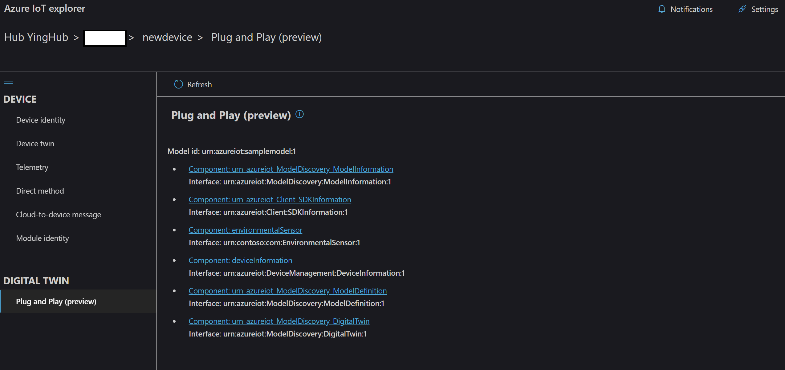

# Azure IoT explorer (preview)

## Table of Contents

- [Getting Azure IoT explorer](#getting-azure-iot-explorer)
- [Features](#features)
- [Contributing](#contributing)

## Getting Azure IoT explorer

You can either download a pre-built version or build it yourself.

### Download a pre-built version

Go to the [Releases](https://github.com/Azure/azure-iot-explorer/releases) tab, download the installer corresponding to your platform and install.

### Run it locally and build it yourself

1. Open a Node capable command prompt
1. Clone the repo: `git clone https://github.com/Azure/azure-iot-explorer.git`
1. Run: `npm install`
1. Run: `npm start`
    - A new tab in your default browser will be opened automatically pointing to the locally running site.
1. [optional] Stop step 4 then run: `npm run build` and then run: `npm run electron`.
    - The electron app will spin up using the bits generated in the dist folder.

If you'd like to package the app yourself, please refer to the [FAQ](https://github.com/Azure/azure-iot-explorer/wiki/FAQ).

## Features

### Configure an IoT Hub connection

- After opening the application, add the connection string for your IoT Hub, then click **Connect**.

### Manage devices

- Click **New** to create a new device.
- Select device(s) and click **Delete** to delete device(s). Multiple devices can be selected by clicking while dragging the mouse.
- Devices can by queried by typing the first few characters of a device name in the query box.

- Click on the device name to see the device details and interact with the device.

### Manage Plug and Play devices

- Open the **Settings** panel to configure how PnP Model definitions can be resolved. For more information on PnP devices, please visit [Microsoft Docs](https://docs.microsoft.com/en-us/azure/iot-pnp/overview-iot-plug-and-play).

- Go to the device details page by clicking the name of a PnP device.
- Click Plug and Play from the navigation. If the device is a Plug and Play device, the Device capability model ID would be shown. A table would show the list of components implemented by the device and the corresponding interfaces the components conform to.

- Click the name of any component, and switch between interface, properties, commands and telemetry to start interacting with the PnP device.

## Contributing

This project welcomes contributions and suggestions.  Most contributions require you to agree to a
Contributor License Agreement (CLA) declaring that you have the right to, and actually do, grant us
the rights to use your contribution. For details, visit https://cla.opensource.microsoft.com.

When you submit a pull request, a CLA bot will automatically determine whether you need to provide
a CLA and decorate the PR appropriately (e.g., status check, comment). Simply follow the instructions
provided by the bot. You will only need to do this once across all repos using our CLA.

This project has adopted the [Microsoft Open Source Code of Conduct](https://opensource.microsoft.com/codeofconduct/).
For more information see the [Code of Conduct FAQ](https://opensource.microsoft.com/codeofconduct/faq/) or
contact [opencode@microsoft.com](mailto:opencode@microsoft.com) with any additional questions or comments.
