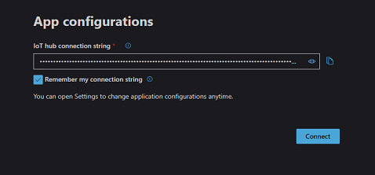
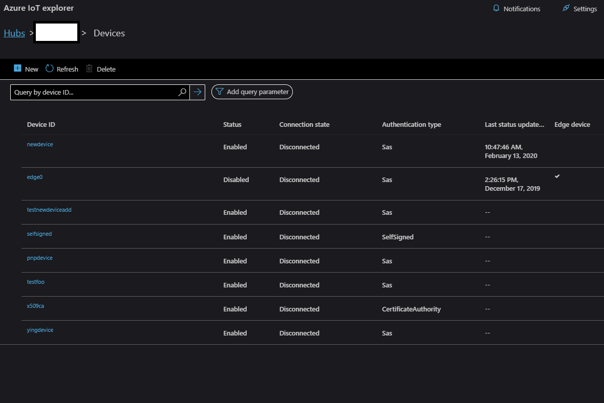
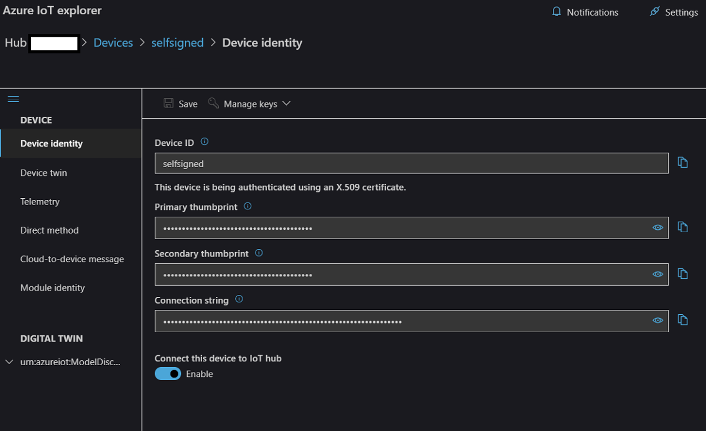
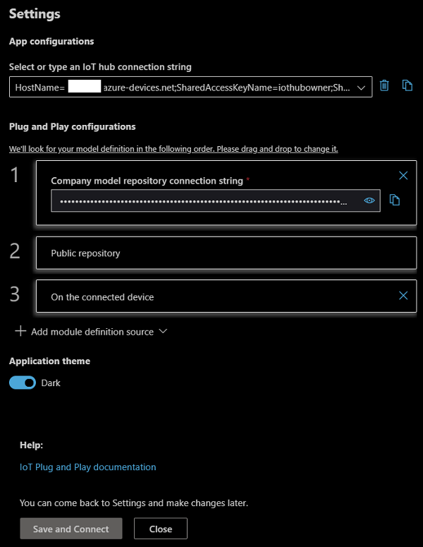
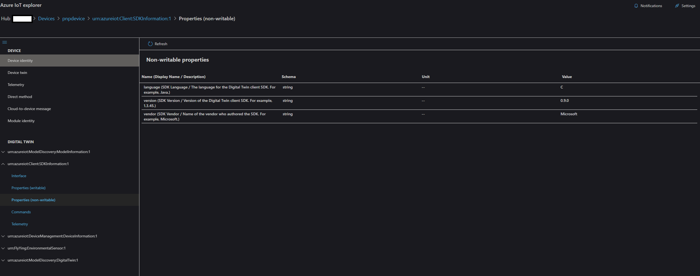

# Azure IoT Plug and Play (PnP) Device Explorer

## Table of Contents
- [Getting Azure IoT explorer](#getting-azure-iot-explorer)
- [Features](#features)
- [Contributing](#contributing)

## Getting Azure IoT explorer

You can either download a pre-built version or build it yourself.

### Download a pre-built version
Go to the [Releases](https://github.com/Azure/azure-iot-explorer/releases) tab, download the installer corresponding to your platform and install.
### Run it locally and build it yourself
1. Open a Node capable command prompt
1. git clone https://github.com/Azure/azure-iot-explorer.git
1. run `npm install`
1. run `npm start`. A new tab in your default browser will be opened automatically and site would be running locally
1. (optional) stop step 4, run `npm run build` and then run `npm run electron`. The electron app would start locally using the bits generated in the dist folder

If you'd like to package the app yourself, please refer to [FAQ](https://github.com/Azure/azure-iot-explorer/wiki/FAQ).

## Features
### Configure an IoT Hub connection

- After opening the application, add the connection string for your IoT Hub, then click **Connect**.

### Manage devices

- Click **New** to a new device.
- Select device and click **Delete** to delete devices. Multiple devices can be selected by clicking while dragging the mouse.
- Devices can by queried by typing the first few characters of device name in the query box.

- Click on the device name to see the device detail and interact with the device.

### Manage Plug and Play devices
- Open **Settings** panel to configure how PnP Model definition can be resolved (for more information and how to simulate a PnP device, please visit https://docs.microsoft.com/en-us/azure/iot-pnp/overview-iot-plug-and-play).

- Go to device details page by click the name of a PnP device.
- Interfaces implemented by the PnP device would be populated under DIGITAL TWIN of the left navigation bar. Open interface, properties, commands or telemetry to start interacting with the PnP device.

## Contributing

This project welcomes contributions and suggestions.  Most contributions require you to agree to a
Contributor License Agreement (CLA) declaring that you have the right to, and actually do, grant us
the rights to use your contribution. For details, visit https://cla.opensource.microsoft.com.

When you submit a pull request, a CLA bot will automatically determine whether you need to provide
a CLA and decorate the PR appropriately (e.g., status check, comment). Simply follow the instructions
provided by the bot. You will only need to do this once across all repos using our CLA.

This project has adopted the [Microsoft Open Source Code of Conduct](https://opensource.microsoft.com/codeofconduct/).
For more information see the [Code of Conduct FAQ](https://opensource.microsoft.com/codeofconduct/faq/) or
contact [opencode@microsoft.com](mailto:opencode@microsoft.com) with any additional questions or comments.
