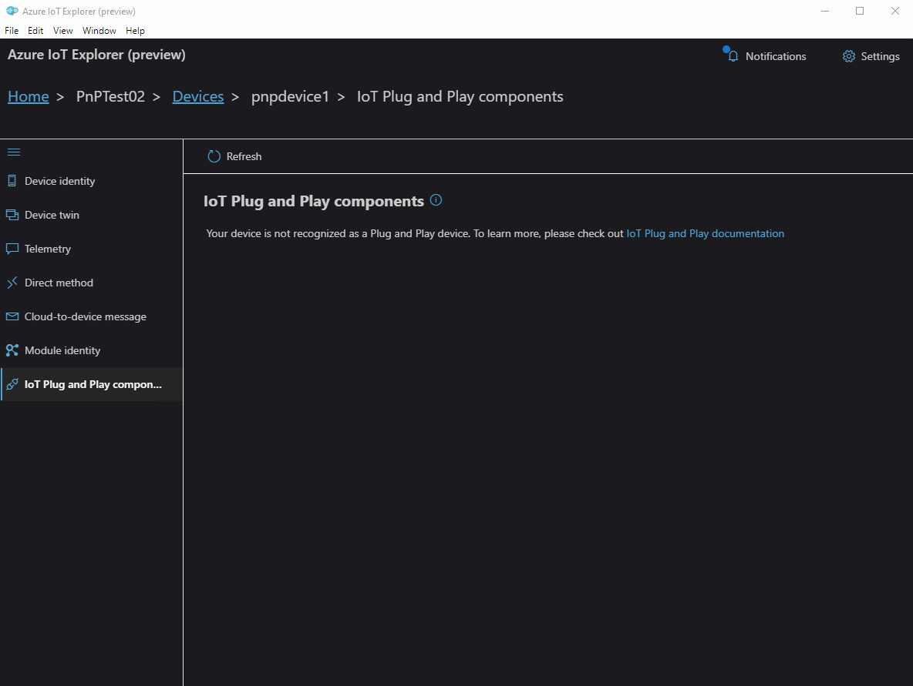

# Azure IoT Explorer (preview)

CI Pipeline 

Release Pipeline 

## Table of Contents

- [Getting Azure IoT Explorer](#getting-azure-iot-explorer)
- [Features](#features)
- [Contributing](#contributing)

## Getting Azure IoT Explorer

You can either download a pre-built version or build it yourself.

### Download a pre-built version

Go to the [Releases](https://github.com/Azure/azure-iot-explorer/releases) tab, download the installer corresponding to your platform and install.

### Install via Chocolatey
Chocolatey is a means to deploy and configure software for Windows operating systems via scripting.

After installing [Chocolatey](chocolatey.org), run `choco install azure-iot-explorer --pre`.

### Run it locally and build it yourself

1. Open a Node capable command prompt
1. Clone the repo: `git clone https://github.com/Azure/azure-iot-explorer.git`
1. Run: `npm install`
1. Run: `npm start`
    - A new tab in your default browser will be opened automatically pointing to the locally running site.
1. [optional] Stop step 4 then run: `npm run build` and then run: `npm run electron`.
    - The electron app will spin up using the bits generated in the dist folder.

If you'd like to package the app yourself, please refer to the [FAQ](https://github.com/Azure/azure-iot-explorer/wiki/FAQ).

## Features

### Configure an IoT Hub connection

- Upon opening the application, choose an authentication method and connect to an Azure IoT hub.
- If you picked **Connect via IoT Hub connection string**, you can add multiple strings, view, update or delete them anytime by returning to Home.
- If you picked **Connect via Azure Active Directory**, you will be redirected to login in through AAD, from where you will be able to pick a subscription, and then pick an IoT hub.
- You can switch back and forth between these two authentication methods.

### Device CRUD

- Click **New** to create a new device.
- Select device(s) and click **Delete** to delete device(s). Multiple devices can be selected by clicking while dragging the mouse.
- Devices can by queried by typing the first few characters of a device name in the query box.

### Device functionalities
- Click on the device name to see the device details and interact with the device.
- Check out the [list of features that we support](https://github.com/Azure/azure-iot-explorer/wiki)

### Plug and Play

**If you are looking for a UI tool to get a flavor of Plug and Play, look no futher. Follow this [Microsoft Docs](https://docs.microsoft.com/en-us/azure/iot-pnp/overview-iot-plug-and-play) to get started.**
- Once your device has gone through discovery, **IoT Plug and Play components** page would be available on device details view.
- The model ID would be shown.
- Follow our guidance to set up how we can retrieve model definitions. If it is already setup, We will inform you where are we resolving your model definitions from.
- A table would show the list of components implemented by the device and the corresponding interfaces the components conform to.
- You can go back to Home (either from device or by directly clicking the breadcrumb) to change how we resolve model definitions. Note this is a global setting which would affect across the hub.

- Click the name of any component, and switch between interface, properties, commands and telemetry to start interacting with the PnP device.

## Contributing

This project welcomes contributions and suggestions.  Most contributions require you to agree to a
Contributor License Agreement (CLA) declaring that you have the right to, and actually do, grant us
the rights to use your contribution. For details, visit https://cla.opensource.microsoft.com.

When you submit a pull request, a CLA bot will automatically determine whether you need to provide
a CLA and decorate the PR appropriately (e.g., status check, comment). Simply follow the instructions
provided by the bot. You will only need to do this once across all repos using our CLA.

This project has adopted the [Microsoft Open Source Code of Conduct](https://opensource.microsoft.com/codeofconduct/).
For more information see the [Code of Conduct FAQ](https://opensource.microsoft.com/codeofconduct/faq/) or
contact [opencode@microsoft.com](mailto:opencode@microsoft.com) with any additional questions or comments.
